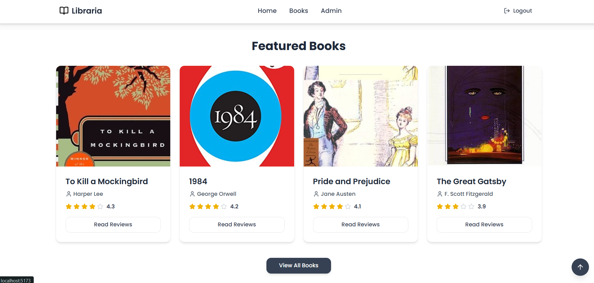

# 📚 Book Review Platform

A user-friendly web application where book lovers can explore, review, and rate books. Admins can manage books and view user insights. Built with modern technologies and clean UI/UX.

---

## 🖼️ Preview




---

## 🚀 Tech Stack

**Frontend**:
- React.js (with Vite)
- Tailwind CSS
- Axios
- React Router
- Lucide React (icons)

**Backend**:
- Node.js
- Express.js
- MongoDB + Mongoose
- JSON Web Token (JWT) for Authentication
- dotenv (for environment variables)
- CORS

**Deployment**:
- **Frontend**: Vercel
- **Backend**: Render

---

## ✨ Features

### 👤 User
- View all books
- Search by title or author
- Filter by rating
- See average star rating for each book
- Read other users’ reviews
- Submit your own review with star rating and comment
- Responsive design for mobile and desktop

### 👑 Admin
- Login as admin
- Add new books with cover image and rating
- Edit and delete books
- View list of users and all reviews
- Dashboard stats: Users, Books, and Reviews count

### 🔐 Authentication
- User login and logout functionality using JWT

---

## 🧪 Functionalities

- Star-based UI rating
- Pagination for book listing
- Scroll-to-top button when scrolling
- Shimmer loading placeholder while data loads
- Protected routes for authenticated users
- Realtime statistics in footer section

---

## 🛠 How to Run Locally

### 1. Clone the Repository

```bash
git clone https://github.com/your-username/book-review-platform.git
cd book-review-platform
